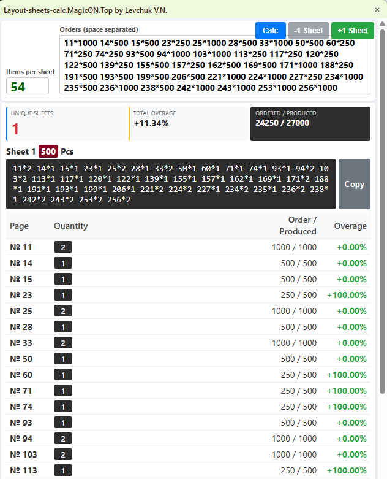

# Layout Sheets Calculator

Layout Sheets Calculator is a Windows desktop application designed to optimize print layouts. It calculates the most efficient way to arrange ordered items (pages/designs) onto print sheets to minimize overproduction (overshoot).

The app is built using Go and `webview2`, combining a fast, concurrent backend with a modern, frameless HTML/JS frontend.



## Features

- **Smart Allocation Algorithm:** Uses a modified D'Hondt method with a priority queue (Max-Heap) to intelligently distribute item slots across print forms, keeping waste to a minimum.
- **Modern Desktop UI:** Features a frameless, resizable window with native Windows rounded corners and custom drag-and-drop support (via Win32 API).
- **Internal HTTP API:** Runs a local web server (`:8123`) to process calculation requests instantly.
- **Caching System:** Remembers previous calculations to instantly load results for identical requests.
- **Min-Overshoot Finder:** Includes a binary search algorithm to automatically find the lowest possible overshoot percentage that reduces the total number of print forms.

## Prerequisites

- **OS:** Windows only (uses Windows-specific `syscall` for window management).

## Project Structure

For the application to run successfully, it requires a specific folder structure. The executable relies on a `settings` folder located in the same directory.

```text
📁 Project Root
├── 📄 main.exe                 # Your compiled Go application
└── 📁 settings                 # Required settings directory
    ├── 📄 index.html           # Required: The frontend UI web page
```
